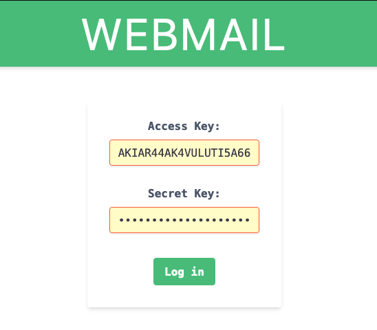
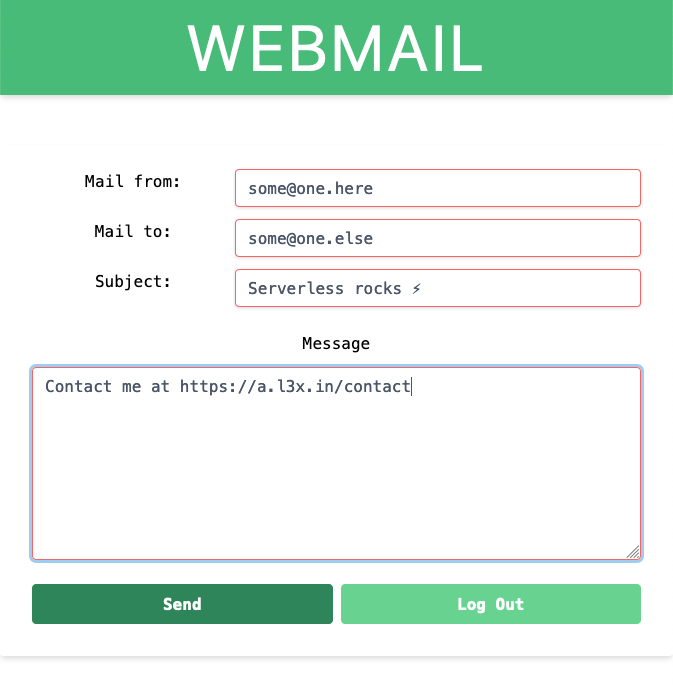

# webmail

A simple Vue3-based web interface to send emails via AWS Lambda: <https://webmail.l3x.in/>

## Use dedicated IAM user's as log-in credentials



Browser will ask to save them.

NOTE: associated IAM policy should allow only the specific Lambda function execution defined in [vue.config.js](vue.config.js), e.g.

```json
{
    "Sid": "LambdaInvoke",
    "Effect": "Allow",
    "Action": [
        "lambda:InvokeFunction"
    ],
    "Resource": "<ARN of your function>"
}
```

More details at <https://docs.aws.amazon.com/lambda/latest/dg/access-control-identity-based.html>

If you use AWS CDK you might want to simply add [something like this](https://github.com/shaftoe/api-l3x-in/commit/00ed010ea13f1f75ba4f4d91884d340e15071ae1) to your stack.

## Send with customizable FROM address

Mail actually delivered by [MailJet](https://dev.mailjet.com/) (via [AWS Lambda proxy](https://github.com/shaftoe/api-l3x-in/blob/master/lib/stacks/notifications/lambda/send_to_mailjet.py))



## Development

```bash
npm install  # install dependencies
make server  # spin up a local Vue3 development server
make build   # create a build in `dist/`
```
